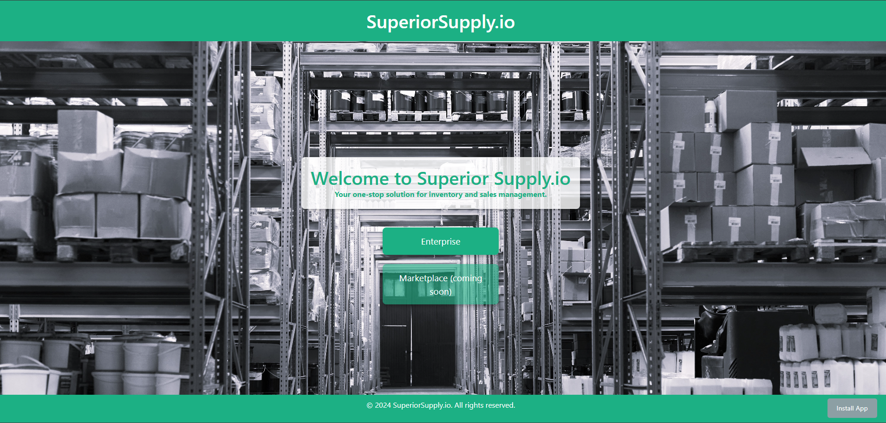
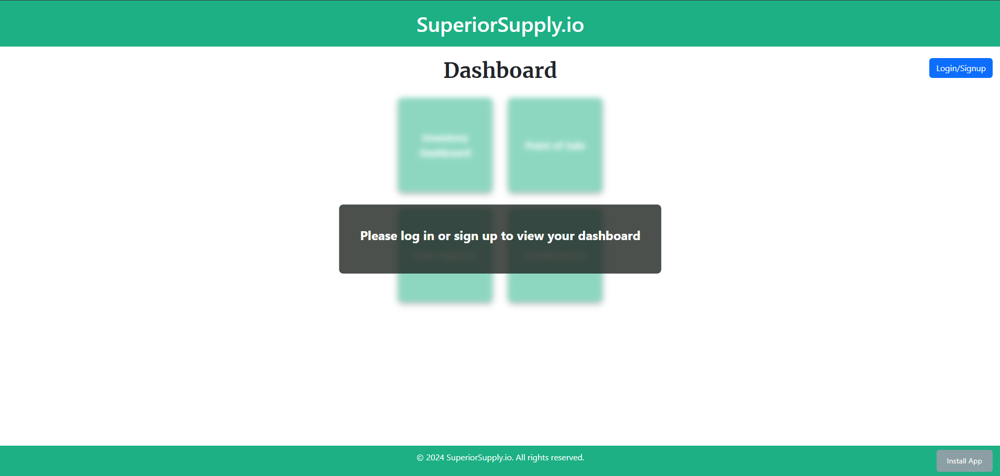
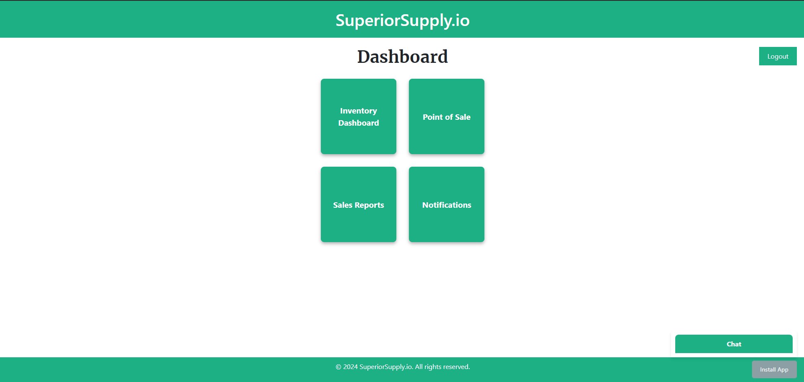

# MyPOSisBetterThanYourPOS

## Description
MyPOSisBetterThanYourPOS, otherwise known as SuperiorSupply.io, is a MERN-stack application designed for managing sales, inventory, and internal communication within a business. The platform integrates technologies such as React, GraphQL, Node.js, Express.js, MongoDB, and JWT for authentication. It features real-time messaging with Socket.io, inventory management, and a point of sales system.

## Table of Contents

- [Installation](#installation)
- [Walkthrough](#walkthrough)
- [Usage](#usage)
- [Features](#features)
- [Technologies](#technologies)
- [Questions](#questions)
- [Citations](#citations)
- [Acknowledgements](#acknowledgements)
- [License](#license)

## Installation

1. Clone the repository:
    ```
    git clone https://github.com/yourusername/myposisbetterthanyourpos.git
    ```

2. Navigate to the root directory:
    ```
    cd myposisbetterthanyourpos
    ```

3. Install dependencies for both the server and client:
    ```
    npm run install
    ```
    This command installs the dependencies in both the server and client directories.

4. Set up environment variables: Create a .env file in the server directory and add the following:
    ```
    MONGODB_URI=your-mongodb-uri
    JWT_EXPIRATION=2h
    SECRET=your-secret-key
    SESSION_SECRET=your-session-secret
    PORT=3000
    ```

5. Seed the database (optional): To populate the database with sample data, run:
    ```
    node server/utils/seedProducts.js
    node server/utils/seedSalesReports.js
    ```

6. Start the application:
    ```
    npm run develop
    ```
    This will start both the server (on port 3000) and the client development server (on port 3000).

## Walkthrough

* Deployed application: https://www.superiorsupply.io/

* Application repository: https://github.com/bldambtn/MyPOSisBetterThanYourPOS 

Homepage


Enterprise page (userdashboard) - user not logged in


Enterprise page (userdashboard) - user logged in


## Usage
1. Access the application: Open your browser and navigate to http://localhost:3000.

2. User Authentication:
    * Sign up or log in with a registered email and password.
    * Once logged in, you can access the dashboard and use the app's features.

3. Inventory Management:
    * Add, update, or delete items in the inventory.
    * Search for products using PLU codes.
4. Sales Reporting:
    * View sales reports filtered by date, product, or category.
    * Analyze daily, weekly, or monthly sales data.
5. Internal Messaging:
    * Chat in real-time with other users within your organization.
    * View missed messages and previous chat history.

## Features
* User Authentication: Secure login and signup using JWT for authentication.
* Inventory Management: Add, edit, and manage inventory items.
* Sales Reporting: Filter and view sales reports by date, product, and category.
* Real-Time Messaging: Communicate instantly with colleagues using Socket.io for WebSocket support.
* Responsive Design: User-friendly and adaptable to various screen sizes.

## Technologies
* Frontend: React, Vite
* Backend: Node.js, Express.js, GraphQL, Apollo Server
* Database: MongoDB, Mongoose
* Authentication: JWT, bcrypt
* Real-Time Communication: Socket.io
* Development Tools: Vite, Jest, Concurrently

## Questions
For any questions or feedback, please contact one of the following:
* https://github.com/shermanburwell3
* https://github.com/TravisHaynie
* https://github.com/nhl1090
* https://github.com/bldambtn

## Citations

* AG Grid. (n.d.). AG Grid: The Best JavaScript Grid in the World. https://www.ag-grid.com/

* Bootcamp. (2024). Module 22, Activities 17, 18, and 26, along with class instruction. University of Texas at Austin. GitHub. https://git.bootcampcontent.com/University-of-Texas-at-Austin/UTA-VIRT-FSF-PT-05-2024-U-LOLC/-/tree/main/22-State/01-Activities?ref_type=heads

* ContextNeutral. (n.d.). The ultimate guide to secure authentication best practices. https://www.contextneutral.com/ultimate-guide-secure-authentication-best

* Coolors. (n.d.). Coolors color scheme generator. https://coolors.co/

* Freepik. (n.d.). Freepik website. https://www.freepik.com/

* Google Developers. (2020, December 10). Getting started with Progressive Web Apps. https://developer.chrome.com/blog/getting-started-pwa

* Google Developers. (n.d.). Progressive Web Apps overview. https://developer.chrome.com/docs/devtools/progressive-web-apps

* Google Developers. (n.d.). Progressive Web Apps. Web.Dev. https://web.dev/explore/progressive-web-apps

* JWT.io. (n.d.). JSON Web Tokens. https://jwt.io/

* MDN Web Docs. (n.d.). Progressive web apps tutorials. Mozilla. https://developer.mozilla.org/en-US/docs/Web/Progressive_web_apps/Tutorials

* MDN Web Docs. (n.d.). Event handlers. Mozilla. https://developer.mozilla.org/en-US/docs/Web/Events/Event_handlers

* MDN Web Docs. (n.d.). Flexbox. Mozilla. https://developer.mozilla.org/en-US/docs/Learn/CSS/CSS_layout/Flexbox

* MDN Web Docs. (n.d.). Handling form submission errors. Mozilla. https://react.dev/reference/react-dom/components/form#handling-form-submission-errors

* MDN Web Docs. (n.d.). Important property. Mozilla. https://developer.mozilla.org/en-US/docs/Web/CSS/important

* MDN Web Docs. (n.d.). Managing state. Mozilla. https://react.dev/learn/managing-state

* MDN Web Docs. (n.d.). Margin. Mozilla. https://developer.mozilla.org/en-US/docs/Web/CSS/margin

* MDN Web Docs. (n.d.). The box model. Mozilla. https://developer.mozilla.org/en-US/docs/Learn/CSS/Building_blocks/The_box_model

* Miro. (n.d.). Miro website. https://miro.com/

* MongoDB. (n.d.). Getting started with MongoDB and Mongoose. MongoDB Developer. https://www.mongodb.com/developer/languages/javascript/getting-started-with-mongodb-and-mongoose/

* Mongoose. (n.d.). Mongoose documentation. https://mongoosejs.com/docs/

* Munroe, C. (2017, May 23). JWT authentication & authorization for APIs built with Node.js. Toptal. https://www.toptal.com/json/jwt-nodejs-security

* NPM. (n.d.). Jsonwebtoken. https://www.npmjs.com/package/jsonwebtoken

* Pexels. (n.d.). Warehouse with concrete floors [Photograph]. https://www.pexels.com/photo/warehouse-with-concrete-floors-4483610/

* React. (n.d.). React documentation. https://react.dev/

* React. (n.d.). Conditional rendering. Legacy React Docs. https://legacy.reactjs.org/docs/conditional-rendering.html

* React. (n.d.). Create portal. React reference. https://react.dev/reference/react-dom/createPortal

* React. (n.d.). Handling events. Legacy React Docs. https://legacy.reactjs.org/docs/handling-events.html

* React. (n.d.). Hooks. React reference. https://react.dev/reference/react/hooks

* React. (n.d.). Sharing state between components. React learning resources. https://react.dev/learn/sharing-state-between-components

* React. (n.d.). Styling. Legacy React Docs. https://legacy.reactjs.org/docs/faq-styling.html

* Vedity. (2023, February 14). How do components interact with each other in React? Medium. https://medium.com/vedity/how-do-components-interact-with-each-other-in-react-4c06a256949b

* W3Schools. (n.d.). CSS box model. https://www.w3schools.com/css/css_boxmodel.asp#:~:text=In%20CSS%2C%20the%20term%20%22box,%2C%20padding%2C%20borders%20and%20margins.

* W3Schools. (n.d.). CSS important property. https://www.w3schools.com/css/css_important.asp

* GitHub Docs. (n.d.). Best practices for pull requests. https://docs.github.com/en/pull-requests/collaborating-with-pull-requests/getting-started/best-practices-for-pull-requests

* GitHub Docs. (n.d.). Resolving a merge conflict on GitHub. https://docs.github.com/en/pull-requests/collaborating-with-pull-requests/addressing-merge-conflicts/resolving-a-merge-conflict-on-GitHub

## Acknowledgements
We would like to acknowledge the assistance provided by Xpert, an AI Learning Assistant from EdX, for guidance on various aspects of full stack application development, including debugging, API configuration, setting up MongoDB Atlas, CSS styling, troubleshooting, and GraphQL.

We also extend our thanks to ChatGPT by OpenAI for assisting with technical support, code suggestions, and guidance throughout the development process.

## License
This project is licensed under the [MIT license](https://opensource.org/license/MIT).

Permission is hereby granted, free of charge, to any person obtaining a copy
of this software and associated documentation files (the "Software"), to deal
in the Software without restriction, including without limitation the rights
to use, copy, modify, merge, publish, distribute, sublicense, and/or sell
copies of the Software, and to permit persons to whom the Software is
furnished to do so, subject to the following conditions:

The above copyright notice and this permission notice shall be included in all
copies or substantial portions of the Software.

THE SOFTWARE IS PROVIDED "AS IS", WITHOUT WARRANTY OF ANY KIND, EXPRESS OR
IMPLIED, INCLUDING BUT NOT LIMITED TO THE WARRANTIES OF MERCHANTABILITY,
FITNESS FOR A PARTICULAR PURPOSE AND NONINFRINGEMENT. IN NO EVENT SHALL THE
AUTHORS OR COPYRIGHT HOLDERS BE LIABLE FOR ANY CLAIM, DAMAGES OR OTHER
LIABILITY, WHETHER IN AN ACTION OF CONTRACT, TORT OR OTHERWISE, ARISING FROM,
OUT OF OR IN CONNECTION WITH THE SOFTWARE OR THE USE OR OTHER DEALINGS IN THE
SOFTWARE.